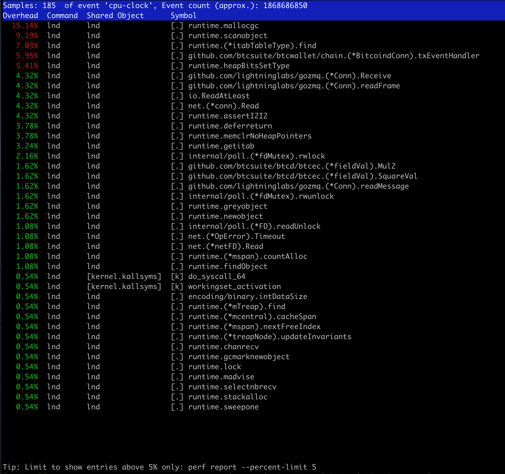
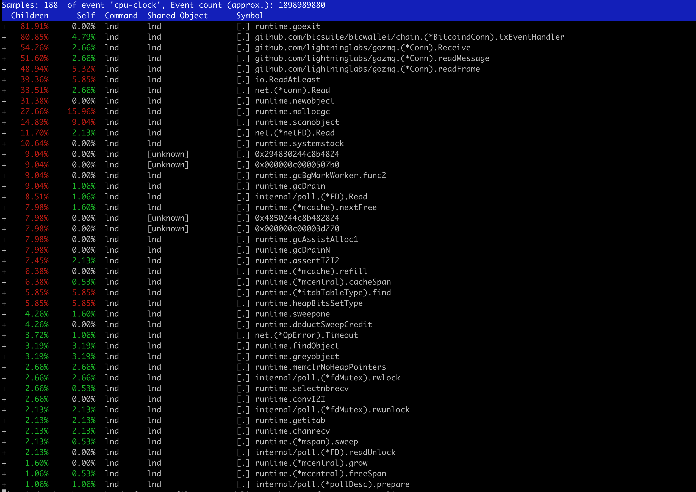
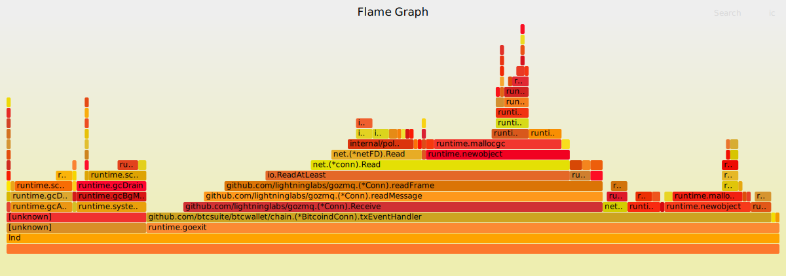

# Incident 1 

Open LND issue  https://github.com/lightningnetwork/lnd/issues/3370 open since Aug 2019.

Not a recent regression - I’ve been noticing this problem for about 1 year. Restarting LND makes it go away for days or weeks.

LND go seem to be stuck in GC / Malloc for the ZMQ.


## Impact

CPU is used close to 100%. In this state, sometimes LND times out when trying to generate new invocies over RPC.

## 2020-02-15 05:34:00 UTC

This time I had no Swap configured. Just plain 2GB of RAM.
Looks same as in previous times


* on-CPU functions (`sudo perf record -F 99 -a -p 18744 -a sleep 5`)
  * 

* call-graph (stack chain/backtrace) recording (`sudo perf record -F 99 -ag -p 18744 -a sleep 5`)
  * 


## 2020-02-09 02:00:00 UTC
* bl3
* 2 GB ram
* 1 CPU core

At 8:30 UTC some of the User CPU is replaced by Steal CPU. Probably due to AWS hypervisor.

```
2020-02-09 02:01:09.504 New block: height=616582, sha=0000000000000000000e8243f6009497933f57dbc5aad956528418cd3e7cb341
Perf stat
          1,609.54 msec cpu-clock                 #    0.322 CPUs utilized
             3,052      context-switches          # 1896.830 M/sec
                 0      cpu-migrations            #    0.000 K/sec
             1,016      page-faults               #  631.448 M/sec
```

LND go seem to be stuck in GC:
```
sudo perf record -F 99  -p 8329  -a sleep 5
sudo perf report
```
  * 
    * for a clickable SVG flame graph, download and open in your web-browser `curl https://raw.githubusercontent.com/alevchuk/minibank/master/incidents/i1-perf-kernel-incident.svg > i1.svg`
    * this SVG was generated like this http://www.brendangregg.com/perf.html#FlameGraphs

### atop ###
```
atop -r  /var/log/atop/atop_20200209
```

Everything looks normal, except CPU goes up for lnd at 2:00
Normal swap in/out activity

### vmstat ###

Everything looks normal, except lot of user level CPU.

I initally had 600 MB swap, yet later turned it off - there was no effect.
```
vmstat 60
procs -----------memory---------- ---swap-- -----io---- -system-- ------cpu-----
 r  b   swpd   free   buff  cache   si   so    bi    bo   in   cs us sy id wa st
 2  0 268960  79412    880 866496    0   10  5303   744  240  678 30  1  0  4 65
 1  0 269592 106500    852 841224    1   11  1731   791  278  694 45  1  0  3 51
 2  0 269536  77964   4784 867516    2    3  2592   474  305  746 51  1  0  1 47
 2  0 269912  78556   4688 860768    6   11  4720   688  218  437 30  1  0  3 66
 1  0 270740  73320   4456 872868    0   14  4180   477  196  547 31  1  0  2 66
 1  1 254124  80680   4452 850024  280    0  2425   389  229  636 31  1  0  1 67
 2  0 223040  82884   4468 819448  504    2  4593  1031  390  855 46  1  0  1 51
 4  0 207124  70064   4448 818868  263    8  6889   401  406  997 49  2  0  2 48
```

Same after swap was turned off and when incdent was happening again

```
procs -----------memory---------- ---swap-- -----io---- -system-- ------cpu-----
 r  b   swpd   free   buff  cache   si   so    bi    bo   in   cs us sy id wa st
 2  0      0  72604    632 620624    0    0  4056  8568 1056 2292 44  3  0 53  0
 1  0      0  67848    640 625300    0    0  1441   143  452  553 99  0  0  1  0
 1  0      0 101772    632 591528    0    0   852  8809  668 1245 96  2  0  2  0
 1  0      0  77336    632 615592    0    0  7133   357  505  596 98  1  0  1  0
 1  0      0  69272    640 623808    0    0  2739    19  365  448 78  0  0  0 22
 2  0      0  68516    640 624476    0    0    79   120  316  465 84  0  0  1 15
 1  2      0  84352    624 607536    0    0  7065  1569  588 1097 30  1  0 32 37
 3  0      0  71280    624 621740    0    0  3585   907  298  582 64  2  0  5 30
 2  0      0  77836    624 613868    0    0  9392     1  157  322 21  1  0  0 78
 2  0      0  72828    624 620140    0    0  2085     0  175  325 73  1  0  0 26
 3  0      0  72828    624 620140    0    0     8     0  147  242 99  1  0  0  0
 3  0      0  87768    624 605292    0    0  3483     0  157  262 15  0  0  0 85
```

### Actions Taken
* Turned off swap → no effect
* Restart LND  → mitigated the issue for days or weeks.

### Restart LND

Mitigates the problem.

Nothing interesting in logs (I don't spot any differences) at the time the incident starts or during shutdown.

This is most likely not related -> on shutdown
```
reason: server: disconnecting peer
PEER: unable to read message from XYZ read tcp 127.0.0.1:42058->127.0.0.1:9050: use of closed network connection
```
